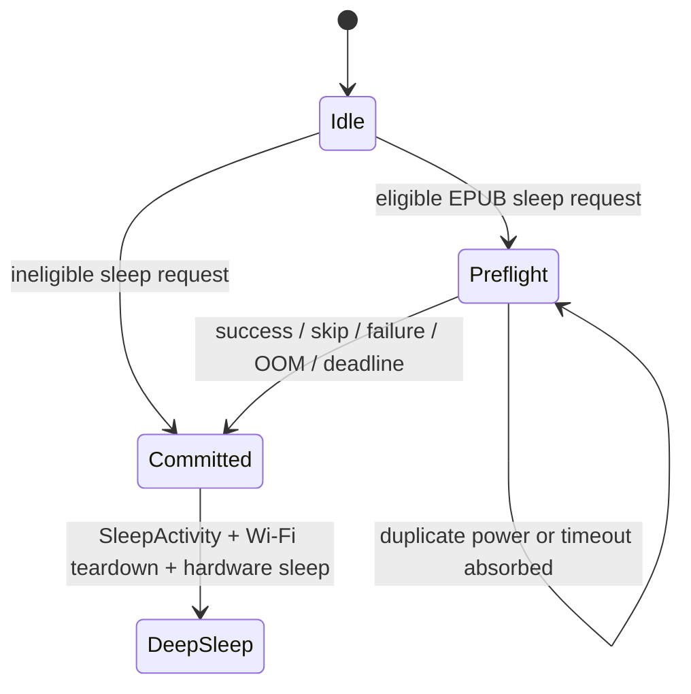

# Automatic Sleep Progress Sync

## Goal Capsule

Add an opt-in KOReader progress-sync setting that runs the existing Smart Sync policy after the user requests sleep or inactivity sleep triggers, then always proceeds to deep sleep. The preflight must be bounded, noninteractive, saved-Wi-Fi-only, and safe within the ESP32-C3's 380 KB RAM ceiling. It must not introduce periodic page-turn work, a resident task, timer wakeups, or a second framebuffer.

## Product Contract

### Problem

Reading progress only synchronizes when the user opens the KOReader Sync menu. That manual step is easy to forget. Sleeping the device is a natural session boundary where unloading the book and briefly using Wi-Fi is acceptable, unlike an every-N-pages trigger that would disrupt reading.

### Requirements

- **R1 — Opt-in preference:** Add `Off` (default) and `When sleeping` under KOReader Sync on both the device and web settings surfaces. Existing settings files must migrate to `Off`, invalid values must normalize to `Off`, and unchanged values must not rewrite storage.
- **R2 — Eligibility:** Automatic pre-sleep sync is eligible only when the sleep originated from an EPUB reader (including a reader below a stacked subactivity), the preference is `When sleeping`, sync behavior is `Smart`, and KOReader credentials exist. `Ask` remains manual-only. Lack of saved Wi-Fi is handled as a fast preflight skip, not an interactive prompt.
- **R3 — Trigger coverage:** The same behavior applies to a held-power-button sleep request and inactivity sleep. The first request captures immutable `fromReader`, `fromTimeout`, and Quick Resume state; repeated triggers are ignored.
- **R4 — Smart semantics:** Reuse the existing furthest-progress-wins Smart Sync behavior, including alternate document-hash probing, local-ahead upload, equal-progress no-op, and remote-ahead local progress save. Manual sync behavior and its prompts remain unchanged.
- **R5 — Bounded networking:** Preflight uses only saved networks and never opens the network picker. One wrap-safe absolute deadline, initially `25,000 ms`, covers Wi-Fi selection/connection, NTP, hashing/mapping checks, TLS connection, HTTP reads, alternate lookup, and upload. No new stage starts after expiry.
- **R6 — Sleep is terminal:** Every skip, success, OOM, save failure, network failure, authentication/server error, malformed response, low-memory rejection, or deadline expiry funnels into one sleep commit exactly once. Preflight cannot be canceled and ignores navigation, Home, and repeated power input.
- **R7 — Memory and battery discipline:** Release the active Section and EPUB before TLS, retain the existing 35 KB free-heap/20 KB maximum-block transport gate, create no resident task, allocate no second 48 KB framebuffer, and add no per-page network or persistence work.
- **R8 — Quick Resume fidelity:** Quick Resume must preserve the reader page framebuffer across preflight and then retain the existing moon-overlay behavior. A preflight failure must never leave a sync or Wi-Fi screen as the saved wake frame.
- **R9 — Observability:** Log eligibility, stage transitions, terminal reason, elapsed time, free heap, and maximum allocatable block using project logging macros. All new user-visible text must use `tr()`.

### User Flows

- **F1 — Eligible power-button sleep:** User holds Power while reading an EPUB → sleep request latches → reader progress is persisted and sync data is prepared → book resources are released → saved Wi-Fi connects headlessly → Smart Sync completes or times out → device commits deep sleep.
- **F2 — Eligible inactivity sleep:** Timeout expires while an EPUB or its stacked subactivity is active → the same preflight runs with `fromTimeout=true` preserved → device commits the correct timeout sleep-screen behavior.
- **F3 — Ineligible sleep:** Setting is Off, behavior is Ask, credentials are absent, or sleep did not originate from an EPUB → no network work starts → current sleep path commits immediately.
- **F4 — Unavailable network or sync failure:** No saved network is usable, the server fails, memory is insufficient, or the absolute deadline expires → failure is logged → device commits sleep without prompts or retry delays.
- **F5 — Quick Resume:** The current reader framebuffer is snapshotted to the existing SD-backed frame mechanism before any preflight UI can replace it → sync runs headlessly → the reader frame is restored → SleepActivity adds its moon and the wake frame is saved → device sleeps.

### Acceptance Examples

- **AE1:** Given Smart Sync, valid credentials, `When sleeping`, and local progress ahead, holding Power uploads progress and the device sleeps without showing an action prompt.
- **AE2:** Given remote progress ahead, inactivity sleep saves the mapped remote position atomically, sleeps, and resumes at that position on wake.
- **AE3:** Given equal progress, automatic sync performs no write and sleeps immediately after the comparison.
- **AE4:** Given no remote record under either supported hash, automatic sync uploads local progress and sleeps regardless of upload result.
- **AE5:** Given Wi-Fi is unavailable or the 25-second deadline expires during Wi-Fi, TLS, alternate lookup, or PUT, the device stops starting work and sleeps exactly once.
- **AE6:** Given sync behavior is Ask or automatic sync is Off, both manual and inactivity sleep bypass preflight; the manual Sync Progress menu behaves as it does today.
- **AE7:** Given a reader menu or footnote activity is stacked above the EPUB reader, sleep still obtains the EPUB progress safely and clears the stack only after preparation.
- **AE8:** Given Quick Resume, waking shows the reader page plus the existing sleep indicator, never a sync status screen.
- **AE9:** Given the power button remains held or the timeout remains elapsed while preflight runs, no second preflight or sleep commit is scheduled.
- **AE10:** Given activity allocation or local progress persistence fails, the error is logged and sleep continues without a crash or bare-`new` abort.

### Scope Boundaries

Included:

- Automatic sync only at the two existing sleep entry points.
- EPUB reading progress through the existing KOReader Smart Sync integration.
- Settings/i18n/web parity, bounded headless saved-Wi-Fi connection, Quick Resume preservation, host policy tests, build/static analysis, and hardware verification instructions.

Excluded:

- Every-N-pages, periodic, background, timer-wake, boot-time, or non-EPUB sync.
- During automatic preflight: interactive Wi-Fi selection, cancellation, notifications/history, repeated retry scheduling, or a success/failure dwell screen.
- Refactoring the entire activity allocation model or the existing shared EPUB ownership model. The unchecked `std::make_shared<Epub>` in the remote-mapping path is a known follow-up risk; this feature must not introduce another unchecked allocation and must retain the existing low-memory gate and hardware stress coverage.
- Commit, push, PR, or release work unless separately requested.

### Product Contract Key Decisions

- **Sleep-only trigger** — `session-settled: user-directed`; chosen over every-N-pages sync because unloading the book during active reading is disruptive. Governs R2, R3, R7.
- **No background worker** — `session-settled: user-approved`; chosen over a resident task or timer wake because the ESP32-C3 has limited RAM and battery. Governs R5, R7.
- **Best-effort terminal preflight** — `session-settled: user-approved`; chosen over prompts or cancel/retry flows because the user has already expressed intent to stop reading. Governs R5, R6, R8.
- **Attempt on every eligible sleep** — chosen over an in-RAM “progress changed” gate because Smart Sync must still discover progress advanced by another device, and deep sleep provides no durable last-remote marker without adding flash writes. Network cost remains bounded to one opt-in attempt per sleep and the absolute deadline. Governs R2, R4, R5.

## Planning Contract

### Existing Evidence

- Both inactivity and power-button triggers call the same synchronous sleep function before the normal activity loop at `src/main.cpp:525-540`; an asynchronous preflight therefore needs a latch or those conditions retrigger on the next loop.
- Sleep origin, Quick Resume selection, `deepSleepInProgress`, SleepActivity rendering, Wi-Fi teardown, and hardware sleep currently occur together at `src/main.cpp:194-228`. Splitting request/preflight/commit must preserve this terminal ordering.
- Activity replacement is deferred and replacement clears the complete stack at `src/activities/ActivityManager.cpp:128-152`; reader-origin detection already searches stacked activities at `src/activities/ActivityManager.cpp:264-270`.
- The manual reader sync path computes KOReader position while the EPUB is resident, persists progress, clears the image extractor, and releases about 65 KB before TLS at `src/activities/reader/EpubReaderActivity.cpp:1161-1210`.
- Current Smart Sync primary/alternate lookup and furthest-progress decision are implemented at `src/activities/reader/KOReaderSyncActivity.cpp:144-269`; automatic mode should adapt terminal routing, not duplicate this algorithm.
- Manual sync currently launches interactive Wi-Fi and can restart back to the reader on exit at `src/activities/reader/KOReaderSyncActivity.cpp:363-397`; sleep mode must be explicit at every terminal and exit path.
- Local progress writes are already value-gated at `src/activities/reader/EpubReaderActivity.cpp:1677-1686`, so this feature needs no new per-page persistence.
- Quick Resume chooses the retained-frame path at `src/main.cpp:199-214`; SleepActivity preserves the existing framebuffer and overlays its indicator at `src/activities/boot_sleep/SleepActivity.cpp:23-29` and `src/activities/boot_sleep/SleepActivity.cpp:333-343`.
- KOReader credential serialization and migration live at `lib/KOReaderSync/KOReaderCredentialStore.cpp:21-79`; the device list is fixed-indexed at `src/activities/settings/KOReaderSettingsActivity.cpp:15-20` and `src/activities/settings/KOReaderSettingsActivity.cpp:68-193`; the web list is built at `src/SettingsList.h:339-384`.
- The transport's existing timeout is per operation/idle wait rather than end-to-end, and Smart Sync can perform multiple requests. Deadline-aware overloads must reach the underlying connect/read abort checks rather than only calling `setTimeout` once (`freeink-sdk/libs/network/SecureNet/include/SecureHttpClient.h:74-79`, `freeink-sdk/libs/network/SecureNet/include/SecureHttpClient.h:480-559`).

### Key Technical Decisions

1. **Use `Idle → Preflight → Committed` sleep coordination.** The first request owns immutable context and all later triggers are absorbed. Only the commit transition sets `deepSleepInProgress`; this preserves the existing guard that prevents Wi-Fi activity teardown from silently restarting the reader.
2. **Separate sleep request from terminal commit.** Keep the existing deep-sleep body as the single commit operation. The request phase evaluates eligibility and either commits directly or schedules preflight; callbacks can request commit but cannot reproduce hardware-sleep steps.
3. **Delegate preparation to the topmost eligible EPUB owner.** Add a narrow Activity capability and ActivityManager traversal so sleep can prepare an EPUB reader beneath a stacked menu/footnote. Capture progress before replacement clears the activity stack.
4. **Give KOReaderSyncActivity explicit Manual and Sleep modes.** Manual remains the default and retains prompts, result screens, auto-return, and reader restart. Sleep mode uses the same Smart state machine but routes every terminal result to the sleep coordinator, never to the reader or an interactive state.
5. **Propagate one absolute, wrap-safe deadline.** Store a small value-type deadline in sleep context; pass remaining time into saved-Wi-Fi connect, NTP, hashing/mapping checkpoints, KOReader client requests, secure HTTP waits, and TLS connect. Abort callbacks enforce the absolute bound even if data trickles. No timer task is created.
6. **Use headless saved-Wi-Fi mode.** Extend the existing selection activity so it tries the last successful saved SSID, then at most one bounded scan for visible saved SSIDs, and calls completion with failure instead of opening `NETWORK_LIST`.
7. **Preserve Quick Resume through SD, not RAM.** Snapshot the reader framebuffer to a dedicated temporary SD frame before preflight can render, restore it immediately before the existing terminal SleepActivity, and remove the temporary file on every terminal path. If the snapshot fails, skip automatic sync and commit while the framebuffer is still intact. This performs bounded SD I/O but avoids an impossible second 48 KB RAM buffer.
8. **Keep new policy code allocation-free.** Eligibility, mode, sleep state, terminal action, and deadline math use enums/POD/`constexpr` helpers. Any activity creation uses `makeUniqueNoThrow` and direct-sleep fallback on OOM. Existing transient strings and the existing secure-client abort callback are permitted only after the EPUB/Section release; no additional container growth or task stack is introduced.

### State Flow



### Failure and Cleanup Invariants

- There is exactly one commit entry point and it is idempotent after `Committed`.
- The request latch is established before any deferred activity replacement.
- `fromReader`, `fromTimeout`, and Quick Resume are captured before the current activity can change.
- EPUB extractor/Section/EPUB release occurs in the existing safe order; activity resources are destroyed in reverse order.
- Sleep-mode input cannot navigate Home, Back, Confirm, or reopen the reader.
- No interactive render occurs in Quick Resume before the snapshot succeeds. The temporary snapshot is removed after restore or on any direct-sleep fallback.
- Wi-Fi is disconnected by terminal commit, including failures before KOReaderSyncActivity fully enters.
- Deadline expiry is checked before every new blocking stage and within the transport's wait/connect loops.

## Implementation Units

### U1 — Add the persisted preference and allocation-free policy seam

**Goal:** Establish settings parity and a pure policy/deadline surface that later lifecycle code can call without heap allocation.

**Files:**

- Modify `lib/KOReaderSync/KOReaderCredentialStore.h`
- Modify `lib/KOReaderSync/KOReaderCredentialStore.cpp`
- Create `lib/KOReaderSync/AutoSleepSyncPolicy.h`
- Create `lib/KOReaderSync/AutoSleepSyncPolicy.cpp`
- Modify `src/activities/settings/KOReaderSettingsActivity.cpp`
- Modify `src/SettingsList.h`
- Modify `lib/I18n/translations/english.yaml`
- Create `test/automatic_sleep_sync/AutomaticSleepSyncPolicyTest.cpp`
- Create `test/automatic_sleep_sync/CMakeLists.txt`
- Modify `test/CMakeLists.txt`

**Approach:** Add a validated enum with Off as zero/default, a getter/setter with a value-change save guard, and matching device/web controls. Keep generated i18n outputs untouched. The policy helper accepts value types only and answers eligibility, wrap-safe remaining deadline, and terminal routing for Manual versus Sleep mode.

**Test scenarios:** Missing/legacy/invalid preference → Off; Smart + credentials + reader origin + enabled → eligible; Ask/Off/no credentials/non-reader → ineligible; wraparound deadline math; manual terminal action remains return/result while every sleep terminal action is commit.

**Verification:** Host unit test registration succeeds and the web/device values have a one-to-one mapping with translated labels.

### U2 — Split sleep into request, preflight, and commit

**Goal:** Make both sleep triggers safely asynchronous while retaining a single existing terminal hardware-sleep path.

**Files:**

- Modify `src/main.cpp`
- Modify `src/activities/Activity.h`
- Modify `src/activities/ActivityManager.h`
- Modify `src/activities/ActivityManager.cpp`
- Modify `src/activities/reader/EpubReaderActivity.h`
- Modify `src/activities/reader/EpubReaderActivity.cpp`
- Extend `test/automatic_sleep_sync/AutomaticSleepSyncPolicyTest.cpp`

**Approach:** Introduce a small coordinator state/context owned at the current sleep-control layer. Convert both existing calls into idempotent requests. Locate an eligible EPUB owner from current activity through the stack, prepare its sync payload using the existing save/map/release sequence, and schedule Sleep-mode sync with `makeUniqueNoThrow`. Directly commit on ineligibility, save failure, or OOM. Preserve sleep origin before replacement.

**Test scenarios:** First request wins; duplicate power/timeout requests do nothing; manual and timeout flags remain distinct; stacked EPUB delegation selects the nearest/topmost eligible owner; prepare/allocation failure selects commit; commit is idempotent.

**Verification:** Review the two trigger sites for complete coverage and confirm no path sets `deepSleepInProgress` before terminal commit.

### U3 — Add bounded, noninteractive saved-Wi-Fi acquisition

**Goal:** Connect without user interaction and without allowing Wi-Fi selection to outlive the sleep deadline.

**Files:**

- Modify `src/activities/network/WifiSelectionActivity.h`
- Modify `src/activities/network/WifiSelectionActivity.cpp`
- Extend `lib/KOReaderSync/AutoSleepSyncPolicy.h`
- Extend `lib/KOReaderSync/AutoSleepSyncPolicy.cpp`
- Extend `test/automatic_sleep_sync/AutomaticSleepSyncPolicyTest.cpp`

**Approach:** Add an explicit Manual/Headless mode and pass the absolute deadline. Manual remains the default. Headless mode loads the credential store, tries last-successful saved Wi-Fi, performs at most one bounded scan for visible saved networks, and completes false instead of rendering the network list. Clamp connection waits and scan work to remaining time.

**Test scenarios:** Last network succeeds; last network fails then visible saved network succeeds; no saved/visible network completes false; deadline before scan/attempt completes false; Manual mode still permits `NETWORK_LIST`.

**Verification:** Device logs show no network-picker state during automatic sleep and elapsed Wi-Fi work never exceeds the shared deadline.

### U4 — Make Smart Sync sleep-aware and deadline-aware end to end

**Goal:** Reuse Smart Sync while ensuring every outcome commits sleep and no transport stage can extend the global bound.

**Files:**

- Modify `src/activities/reader/KOReaderSyncActivity.h`
- Modify `src/activities/reader/KOReaderSyncActivity.cpp`
- Modify `lib/KOReaderSync/KOReaderSyncClient.h`
- Modify `lib/KOReaderSync/KOReaderSyncClient.cpp`
- Modify `freeink-sdk/libs/network/SecureNet/include/SecureHttpClient.h`
- Modify `freeink-sdk/libs/network/SecureNet/include/SecureClient.h`
- Modify `freeink-sdk/libs/network/SecureNet/src/SecureClient.cpp`
- Extend `test/automatic_sleep_sync/AutomaticSleepSyncPolicyTest.cpp`

**Approach:** Add an explicit Sleep mode and terminal callback/context, defaulting existing constructors/calls to Manual. Thread the absolute deadline through NTP and every GET/PUT; set per-call timeout to remaining time and supply an abort check to connect/read loops. Check expiry before alternate lookup, EPUB reload/mapping, and PUT. Branch terminal helpers so Sleep mode never enters choices, result dwell, `returnToReader`, or `silentRestartToReader`. Log heap and largest block before TLS and the terminal reason before commit.

**Test scenarios:** Primary/alternate not-found, local-ahead, remote-ahead, equal, GET/PUT failure, auth/server/JSON error, low-memory, and expiry before each subsequent stage all select commit in Sleep mode; the corresponding Manual policy remains unchanged.

**Verification:** Static inspection confirms all Smart branches terminate through the mode-aware helper and the absolute deadline reaches TLS connect plus HTTP wait/body loops, not only the outer activity.

### U5 — Preserve Quick Resume and close the full integration loop

**Goal:** Prevent preflight rendering from replacing the reader frame and verify complete cleanup on device.

**Files:**

- Modify `src/main.cpp`
- Modify `src/activities/reader/KOReaderSyncActivity.cpp`
- Modify `src/activities/boot_sleep/SleepActivity.cpp` only if a narrow restore hook is required; prefer keeping existing SleepActivity behavior unchanged
- Modify `lib/I18n/translations/english.yaml` for any non-Quick-Resume progress label introduced by U4
- Extend `test/automatic_sleep_sync/AutomaticSleepSyncPolicyTest.cpp`

**Approach:** Reuse the current HAL-backed SD framebuffer helpers with a distinct temporary preflight snapshot and no RAM copy. Snapshot before preflight UI, suppress preflight rendering for Quick Resume, restore before terminal SleepActivity, then retain the existing moon/save ordering. For non-Quick-Resume modes, a translated transient sync status is allowed but terminal failures have no dwell.

**Test scenarios:** Snapshot success/restore cleanup; snapshot failure skips preflight; power-button Quick Resume and timeout-only Quick Resume preserve the page; non-Quick-Resume can render status; every terminal path removes the temporary snapshot and tears Wi-Fi down.

**Verification:** Hardware checks cover all sleep-screen modes and orientations, including sleep from the reader and from a stacked subactivity.

## Sequencing and Dependencies

1. U1 defines the setting, policy types, and tests.
2. U2 consumes U1 to establish lifecycle ownership and the terminal funnel.
3. U3 and the transport portion of U4 can proceed after U1, but U4's activity integration depends on U2 and U3.
4. U5 completes Quick Resume and integration after U2–U4.
5. Run formatting, host tests, firmware build, static analysis, and diff hygiene only after all code units settle; do not commit generated i18n headers.

## Verification Contract

### Automated gates

Run on macOS (`Darwin`, detected for this session):

```bash
cmake -S test -B build/test
cmake --build build/test
ctest --test-dir build/test --output-on-failure
pio run
pio check
git diff --check
```

Run the repository's formatting workflow only on modified C/C++ files. Regenerate i18n through the documented generator or normal PlatformIO pre-build, but commit only `lib/I18n/translations/english.yaml`, never ignored generated headers.

### Device gates

Using `python3 scripts/debugging_monitor.py`, record elapsed preflight time, `ESP.getFreeHeap()`, and the largest allocatable block before reader release, before TLS, after terminal cleanup, and after wake. Verify:

- Power-button sleep and inactivity sleep from an EPUB, plus both triggers while a reader subactivity is stacked.
- Off, Ask, missing credentials, no saved Wi-Fi, wrong password, server unavailable, malformed/auth failure, and deadline expiration during Wi-Fi/TLS/alternate GET/PUT.
- Local-ahead upload, remote-ahead atomic save and wake position, equal progress, and no remote record.
- Held Power and continuously expired inactivity timeout do not duplicate preflight.
- Quick Resume, timeout-only Quick Resume, cover/static/custom sleep modes, and all four orientations.
- No interactive network/result screen, no silent restart, and deep sleep occurs after every outcome.
- Free heap and largest block return to the expected post-reader/post-Wi-Fi baseline; no additional FreeRTOS task remains and no second framebuffer allocation occurs.

The exact 25-second deadline is a compile-time constant. If hardware logs show valid saved-Wi-Fi + TLS cannot complete within it under normal conditions, adjust the constant once using captured stage timings; do not weaken the absolute-deadline architecture.

## Risks and Mitigations

- **TLS can outlive outer timeouts:** Propagate the deadline into connect and abort loops; verify expiration inside the lowest transport layer.
- **Activity replacement can lose reader context:** Capture immutable origin and sync payload before replacement; traverse the stack through a narrow capability.
- **Quick Resume can save the wrong screen:** SD-snapshot before preflight and restore before SleepActivity; never allocate a RAM copy.
- **OOM after book release:** Preserve the existing transport heap gate, use nothrow activity allocation, log both heap metrics, and commit sleep on failure.
- **Manual sync regression:** Default every new mode parameter to Manual and cover mode decisions in pure host tests; avoid rewriting the Smart comparison algorithm.
- **Battery cost when progress is unchanged:** Limit work to the explicit opt-in sleep boundary and 25-second absolute deadline. Do not add periodic checks; attempting each eligible sleep is required to discover remote-ahead progress.
- **Flash/SD wear:** Reuse the existing value-gated local progress save. The only new repeated write is the 48 KB temporary Quick Resume snapshot, needed only for eligible Quick Resume sleep and removed after restoration.

## Definition of Done

- R1–R9 and AE1–AE10 are satisfied with no periodic/background synchronization.
- Both sleep triggers use the latched request/preflight/commit flow and every terminal path reaches deep sleep exactly once.
- Manual KOReader sync retains current prompts, return behavior, and matching semantics.
- Automatic mode never opens interactive Wi-Fi or result UI and cannot exceed the absolute deadline.
- Quick Resume wakes to the reader page with the existing indicator, not a preflight screen.
- No new resident task, second framebuffer, bare `new`, unchecked new activity allocation, raw SdFat access, or user-facing hardcoded string is introduced.
- Host tests, firmware build, static analysis, formatting, and `git diff --check` pass.
- Hardware verification results include timing and heap/max-block measurements, with any device-only gaps explicitly reported.
- Only source YAML is tracked for i18n; generated and unrelated untracked files remain untouched.
